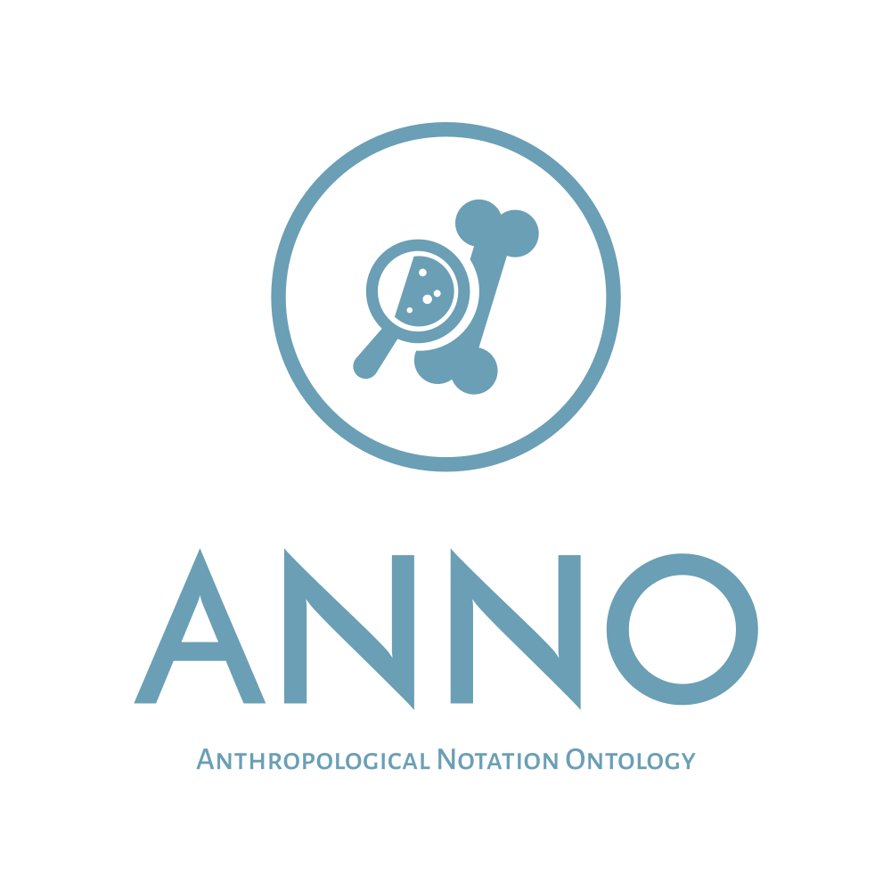
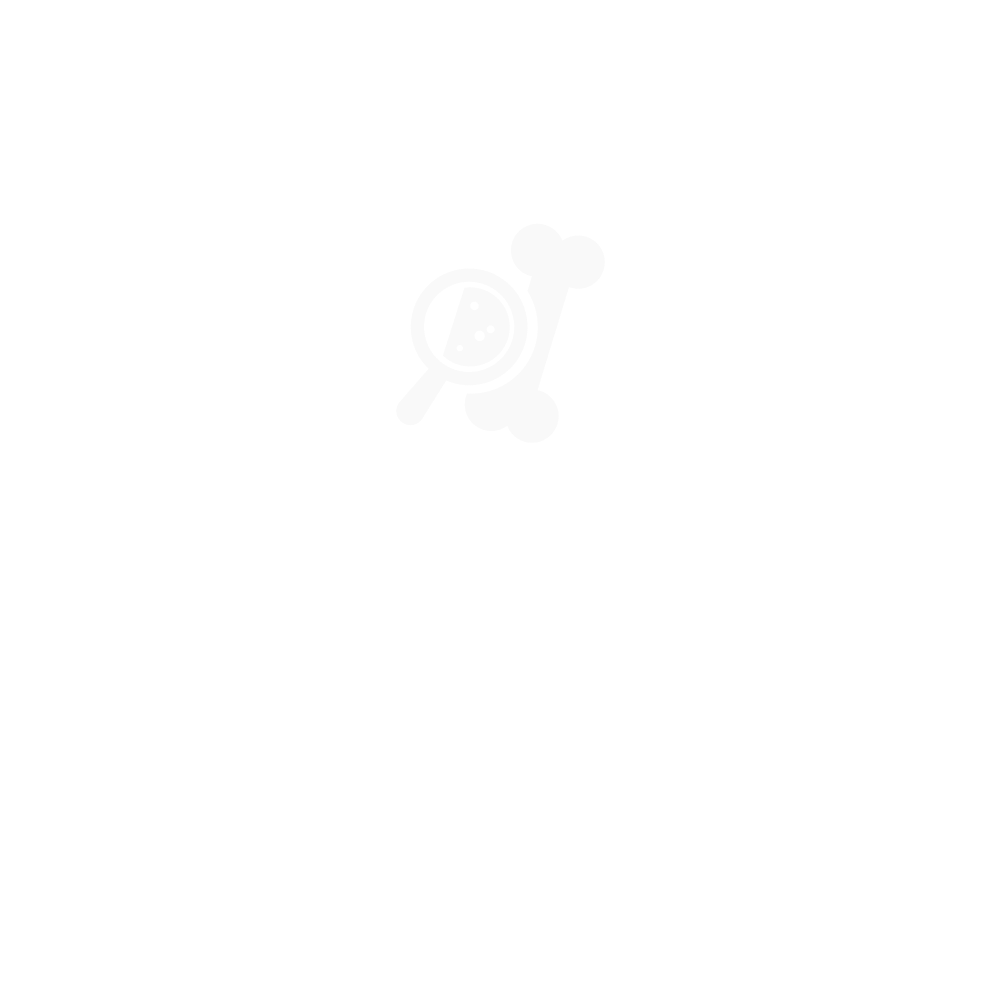
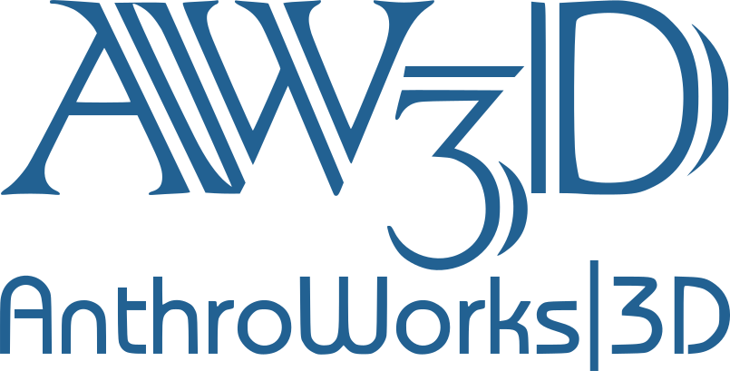

Aufgrund des Verpixelns von Rasterbildern sollen Vektorformate verwendet werden.
Ausnahme ist das Fosil-Logo, dessen Vektorisierungsqualität nicht ausreichend ist.
SVG-Dateien sind zur Anzeige auf Webseiten geeignet während PDF-Bilder für die Einbettung in LaTeX (pdflatex) angeboten werden.
Das <a href="https://www.freistaat.sachsen.de/wappen-und-flaggen-3916.html">sächsische Siegel</a> zeigt die Förderung durch SaxFDM an.
Das ANNO-Logo wurde mit einem Online-Logogenerator erzeugt, welcher die freie Verwendung erlaubt.
Die weißen Bilder sind auf weißem Hintergrund unsichtbar.
## Logos

<table>
<tr><th></th>													<th></th>																																		<th>Download</th></tr>
<tr><td>ANNO blau</td>											<td></td>							<td><a href="./public/anno-logo-blue.svg">SVG</a></td></tr>
<tr><td>ANNO weiß</td>											<td></td>	<td><a href="./public/anno-logo-white.svg">SVG</a></td></tr>
<tr><td>ANNO Icon, hellblau/weiß abhängig vom Farbschema.</td>	<td></td>					<td><a href="./public/icon.svg">SVG</a></td></tr>
<tr><td>Universität Leipzig Medizinische Fakultät</td>			<td></td>								<td><a href="./public/medfak.svg">SVG</a>, <a href="./public/medfak.pdf">PDF</a></td></tr>
<tr><td>IMISE</td>												<td></td>										<td><a href="./public/imise-logo.svg">SVG</a>, <a href="./public/imise-logo.pdf">PDF</a></td></tr>
<tr><td>Hochschule Mittweida</td>								<td></td>						<td><a href="./public/hsmw-logo.svg">RGB SVG</a>, <a href="./public/hsmw-logo-cmyk.pdf">CYMK PDF</a></td></tr>
<tr><td>Sachsen <a href="https://saxfdm.de/">SaxFDM</a></td>	<td></td>								<td><a href="./public/signet-gruen.svg">SVG</a></td></tr>
<tr><td><a href="https://www.forschung.hs-mittweida.de/news/aktuell/6790/">AnthroWorks 3D</a></td>		<td></td>			<td><a href="./public/anthroworks-logo.svg">SVG</a>, <a href="./public/anthroworks-logo.pdf">PDF</a></td></tr>
<tr><td><a href="https://www.forschung.hs-mittweida.de/news/aktuell/6790/">AnthroWorks 3D</a> Icon</td>	<td></td>	<td><a href="./public/anthroworks-icon.svg">SVG</a>, <a href="./public/anthroworks-icon.pdf">PDF</a></td></tr>
<tr><td><a href="https://forensik.hs-mittweida.de/">FoSIL</a></td>										<td></td>		<td><a href="./public/fosil-logo.svg">SVG</a>, <a href="./public/fosil-logo.pdf">PDF</a>, <a href="./public/fosil-logo.png">png</a></td></tr>
</table>
