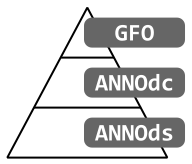
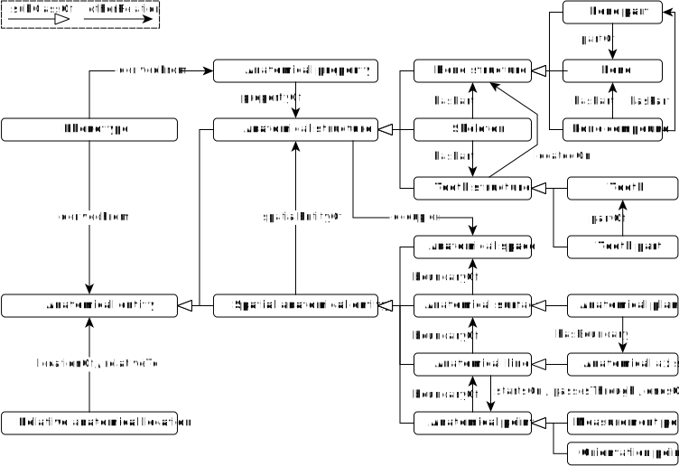
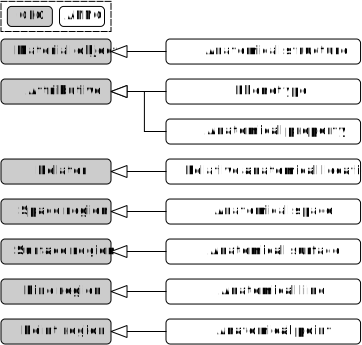

<!--
{{ site.description }}
-->
<!--

-->

## Projektinformationen

Ziel des SaxFDM-Fokusprojektes ist die Entwicklung einer Ontologie für die einheitliche Einordnung der Knochenfunde aus den Ausgrabungen in das Skelettsystem, die Beschreibung der Skelettstücke sowie die Definition von Funktionen zur Ableitung verschiedener Phänotypen des Menschen.
Die Ontologie soll in einem Terminologieservice verwaltet werden, der sich mit denen der NFDI synchronisieren kann.

Projektlaufzeit: 2022-2023

Eine Auswahl unserer Visualisierungen, Schnittstellen und Werkzeuge:

  <a title="Browse" href="ontology">RDF-Browser
  
</a>

  <a title="Browse" href="https://ols.imise.uni-leipzig.de/ontologies/anno">Terminologieserver
  
</a>

---
## Diagramme
---

  
  ANNOdc

  
  ANNO GFO Fundierung

---
